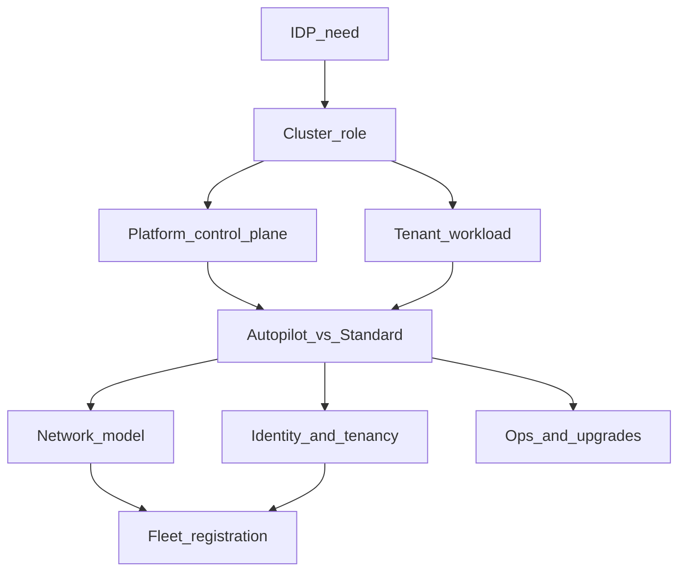

# IDP GKE considerations (POC)

What to take into account when deploying **multiple GKE cluster flavors** for an Internal Developer Platform (IDP), using [Cloud Foundation Fabric](https://github.com/GoogleCloudPlatform/cloud-foundation-fabric) modules.

This document is **background / planning only** (flavors, trade-offs). It is **not** an active backlog for this repo.

The implemented PoC uses **Fabric Standard** as the shared runtime (Confluence default) — see [DEMO-RUNBOOK.md](DEMO-RUNBOOK.md) and [IDP-GKE-POC-FLEETS-TENANTS.md](IDP-GKE-POC-FLEETS-TENANTS.md). Workload Identity, Config Sync, and multi-cluster stretch items below were **not** built.

## Scope (assumed)

Both sides of an IDP on GKE:

1. **Platform clusters** — host the IDP control plane (portal, APIs, controllers, often CI runners).
2. **Tenant / workload clusters** — flavors the platform offers to application teams.

Adjust or drop a section if your POC only covers one side.

---

## 1. Current POC baseline

| Item | Today in this repo |
|------|--------------------|
| Cluster mode | **Standard** via `fabric/modules/gke-cluster-standard` + `gke-nodepool` (Confluence default) |
| Fabric pin | [v57.0.0](../fabric/FABRIC_VERSION) |
| Vendored modules | standard, nodepool, hub (autopilot module still vendored, unused) |
| Networking | Project VPC subnet + pods/services ranges; **Cloud NAT**; **private nodes** + **DNS endpoint** |
| Capacity knobs | `standard{}` in tfvars: machine type, max pods/node, pool min/max |
| Fleet | Registered via `fleet_project` + thin `gke-hub` |
| State | Local Terraform state |
| Multi-flavor switch | Not implemented (single Standard path in `gke.tf`) |

**Gaps vs full Confluence / production IDP:**

- No Shared VPC (project VPC approximation)
- No private IP control-plane + authorized networks (DNS endpoint instead)
- No Workload Identity / Argo CD / Binary Authorization demos
- No remote state or teammate isolation beyond ad-hoc tfvars
- Autopilot remains a valid **future** catalog flavor, not this PoC’s runtime

This matches **path B**: fabric **modules** in a demo project, not full Fabric FAST org stages.

---

## 2. Decision map — what an IDP must choose per cluster

Every cluster the IDP creates (or that hosts the IDP) should have explicit answers for the areas below.

### Mode (Autopilot vs Standard)

| Why it matters for IDP | Fabric knobs | Docs |
|------------------------|--------------|------|
| Confluence default is **Standard** (shared multi-workload). Autopilot is optional for small/spiky or isolated workloads. Standard is required for explicit node pools, custom shapes, some DaemonSets, GPUs, or privileged/host patterns. | `gke-cluster-standard` + `gke-nodepool` (PoC default); optional `gke-cluster-autopilot` | [Choose cluster mode](https://cloud.google.com/kubernetes-engine/docs/concepts/choose-cluster-mode), Confluence Building Block View |

### Topology and upgrades

| Why it matters for IDP | Fabric knobs | Docs |
|------------------------|--------------|------|
| Regional clusters for HA of platform/tenant prod; release channel affects how fast CVE/version rolls land. | `location`, `release_channel`, `maintenance_config` | [Release channels](https://cloud.google.com/kubernetes-engine/docs/concepts/release-channels) |

### Network

| Why it matters for IDP | Fabric knobs | Docs |
|------------------------|--------------|------|
| VPC-native Pod/Service ranges are mandatory. Shared VPC is typical in enterprises; demo uses project VPC. Private clusters change how the IDP/agents reach the API server. | `vpc_config` (network, subnetwork, secondary ranges); `access_config` (private nodes, authorized ranges) | [VPC-native clusters](https://cloud.google.com/kubernetes-engine/docs/concepts/alias-ips), [Private clusters](https://cloud.google.com/kubernetes-engine/docs/how-to/private-clusters) |

CIDR planning must avoid overlaps when many teams get a cluster on the same VPC (see earlier teammate subnet discussion).

### Identity and tenancy

| Why it matters for IDP | Fabric knobs | Docs |
|------------------------|--------------|------|
| Workload Identity is the default GCP↔K8s auth path. Tenancy model drives blast radius: **namespace-per-team** on a shared cluster vs **cluster-per-team** (or per-env). | Autopilot WI defaults; Standard `workload_identity` / node metadata; optional `fleet_project` | [Workload Identity](https://cloud.google.com/kubernetes-engine/docs/how-to/workload-identity) |

### Security

| Why it matters for IDP | Fabric knobs | Docs |
|------------------------|--------------|------|
| Platform clusters often need stricter defaults (Binary Auth, shielded nodes, CMEK, restricted egress). Tenant flavors may trade strictness for flexibility. | `enable_features` (e.g. binary_authorization, database_encryption), node shielded settings on Standard/nodepool | [Harden your cluster](https://cloud.google.com/kubernetes-engine/docs/how-to/hardening-your-cluster) |

### Multicluster (Fleet)

| Why it matters for IDP | Fabric knobs | Docs |
|------------------------|--------------|------|
| IDPs usually manage many clusters: shared policy (Config Sync), inventory, multi-cluster services. Fleet is the GKE grouping boundary. | `gke-hub` module; `fleet_project` on cluster modules | [Fleet concepts](https://cloud.google.com/kubernetes-engine/fleet-management/docs/fleet-concepts), [Config Sync](https://cloud.google.com/kubernetes-engine/enterprise/config-sync/docs/overview) |

### Observability

| Why it matters for IDP | Fabric knobs | Docs |
|------------------------|--------------|------|
| Platform needs consistent logs/metrics across flavors for SLOs and tenant support. | `logging_config`, `monitoring_config` (Autopilot baselines differ from Standard) | [GKE logging](https://cloud.google.com/stackdriver/docs/solutions/gke/installing), [GKE metrics](https://cloud.google.com/stackdriver/docs/solutions/gke/managing-metrics) |

### Cost and sizing

| Why it matters for IDP | Fabric knobs | Docs |
|------------------------|--------------|------|
| Autopilot bills largely from Pod requests (defaults apply if unset). Standard bills node pools (idle cost even with no apps). IDP catalog should set expectations per flavor. | Autopilot: workload requests; Standard: `gke-nodepool` machine/disk/autoscaling | [Autopilot resource requests](https://cloud.google.com/kubernetes-engine/docs/concepts/autopilot-resource-requests) |

### IaC and platform operations

| Why it matters for IDP | Fabric knobs | Docs |
|------------------------|--------------|------|
| Each provisioned cluster needs clear state ownership (remote state per tenant or per request). POC can stay module-based; full FAST is for org landing zones later. | Root module wrappers; remote backend (later) | [Fabric FAST](https://github.com/GoogleCloudPlatform/cloud-foundation-fabric/blob/master/fast/README.md) |

### IDP product surface

The portal/API should expose a **flavor ID** plus a small input set (project, region, network refs, owner/team, optional GPU size). Terraform (or a pipeline) maps flavor → fabric modules + defaults. Keep human-facing choices few; hide fabric variable sprawl behind the flavor.

---

## 3. Proposed cluster flavor catalog (POC target)

Implement later as thin wrappers / `flavor` switches—not in this doc phase.

| Flavor ID | Mode | Typical IDP use | Fabric modules | Minimum inputs | Fleet |
|-----------|------|-----------------|----------------|----------------|-------|
| `shared-standard` (PoC / Confluence default) | Standard | Shared multi-workload DEV/runtime | `gke-cluster-standard` + `gke-nodepool` | project, region, VPC/subnet, machine type, min/max, max pods | Recommended |
| `tenant-standard` | Standard | Dedicated / custom machines, DaemonSets, privileged/host | same | Above + unique name/CIDRs | Optional |
| `tenant-standard-gpu` | Standard + GPU pool | ML / inference (stretch) | `gke-cluster-standard` + GPU `gke-nodepool` | Above + accelerator type/count, drivers | Optional |
| `tenant-autopilot` | Autopilot | Small/spiky or isolated project-per-app (Confluence: not default) | `gke-cluster-autopilot` | project, region, VPC/subnet | Optional |
| `platform-cicd` | Autopilot or Standard | Isolated runners / build agents | autopilot **or** standard + nodepool | Prefer network isolation from prod tenants | Optional |

### What the IDP should collect from the user (per request)

- **Always:** team/owner id, environment (dev/stage/prod), region, flavor ID.
- **Network:** host project + VPC + subnet (or “use platform default network factory”).
- **Standard only:** node size class (or fixed SKUs in the catalog), autoscaling bounds.
- **GPU only:** GPU type/count, optional spot.
- **Never dump raw fabric `variables.tf` into the UI** — map UI fields → module inputs in code.

---

## 4. Fabric module mapping

Vendored in this repo @ v57.0.0:

| Module | Role in IDP POC | Local README |
|--------|-----------------|--------------|
| `gke-cluster-standard` | **PoC / Confluence default** shared Standard runtime | [README](../fabric/modules/gke-cluster-standard/README.md) |
| `gke-nodepool` | Required companion for Standard | [README](../fabric/modules/gke-nodepool/README.md) |
| `gke-cluster-autopilot` | Optional future catalog flavor (vendored, unused in PoC path) | [README](../fabric/modules/gke-cluster-autopilot/README.md) |
| `gke-hub` | Fleet membership and fleet features for multi-cluster IDP | [README](../fabric/modules/gke-hub/README.md) |

Upstream: [cloud-foundation-fabric](https://github.com/GoogleCloudPlatform/cloud-foundation-fabric).

**FAST vs modules:** full [Fabric FAST](https://github.com/GoogleCloudPlatform/cloud-foundation-fabric/blob/master/fast/README.md) bootstraps org folders, networking factories, security, etc. Current master no longer ships a dedicated GKE stage; GKE is composed with these modules (and your own stage/wrappers). This POC stays on **modules only** until a landing zone is in scope.

---

## 5. External documentation index

- [GKE Autopilot overview](https://cloud.google.com/kubernetes-engine/docs/concepts/autopilot-overview)
- [Autopilot resource requests](https://cloud.google.com/kubernetes-engine/docs/concepts/autopilot-resource-requests)
- [Choose cluster mode (Autopilot vs Standard)](https://cloud.google.com/kubernetes-engine/docs/concepts/choose-cluster-mode)
- [VPC-native clusters / alias IPs](https://cloud.google.com/kubernetes-engine/docs/concepts/alias-ips)
- [Private clusters](https://cloud.google.com/kubernetes-engine/docs/how-to/private-clusters)
- [Fleet management concepts](https://cloud.google.com/kubernetes-engine/fleet-management/docs/fleet-concepts)
- [Workload Identity](https://cloud.google.com/kubernetes-engine/docs/how-to/workload-identity)
- [Hardening GKE](https://cloud.google.com/kubernetes-engine/docs/how-to/hardening-your-cluster)
- [Config Sync overview](https://cloud.google.com/kubernetes-engine/enterprise/config-sync/docs/overview)
- [Fabric FAST README](https://github.com/GoogleCloudPlatform/cloud-foundation-fabric/blob/master/fast/README.md)

---

## 6. Suggested POC roadmap (later implementation)

Checklist only—do not treat as done:

1. Keep Standard as the default catalog flavor; add Autopilot only as an explicit alternate.
2. Parameterize network per owner/flavor (unique subnet names + non-overlapping CIDRs).
3. Multi-cluster / Fleet scopes after single-cluster tenancy is solid.
4. If the POC graduates: Shared VPC, private IP control plane + authorized networks, Workload Identity, remote state, FAST stages.

---

## 7. Open questions (fill in)

Use this section as a working checklist with stakeholders.

| Question | Answer / notes |
|----------|----------------|
| Shared VPC (host project) or project-local VPC for the POC? | **Project VPC** approximation; Shared VPC = prod/LZ |
| Fleet host project id? | **Same as cluster** (`roberto-gke`) |
| Tenancy model: namespace-per-team, cluster-per-team, or hybrid? | **Namespace-per-team** on shared Standard |
| Is GPU (`tenant-standard-gpu`) in scope for v1 of the POC? | **No** |
| Private-only API endpoint required (compliance)? | Prod: yes (LZ). PoC: **DNS endpoint** + private nodes |
| Which IDP product (Backstage, Port, custom, other)? | |
| Who owns Terraform state for tenant clusters (platform team vs pipeline per request)? | |
| Prod-like release channel (`REGULAR` vs `STABLE`) for platform vs tenants? | |
| Config Sync / policy required from day one? | |

---

## Related repo paths

- Current Standard wiring: [`gke.tf`](../gke.tf)
- Demo network + NAT: [`network.tf`](../network.tf)
- Fabric pin: [`fabric/FABRIC_VERSION`](../fabric/FABRIC_VERSION)
- Locked scope + client demo: [IDP-GKE-POC-FLEETS-TENANTS.md](IDP-GKE-POC-FLEETS-TENANTS.md)
- Live runbook: [DEMO-RUNBOOK.md](DEMO-RUNBOOK.md)
