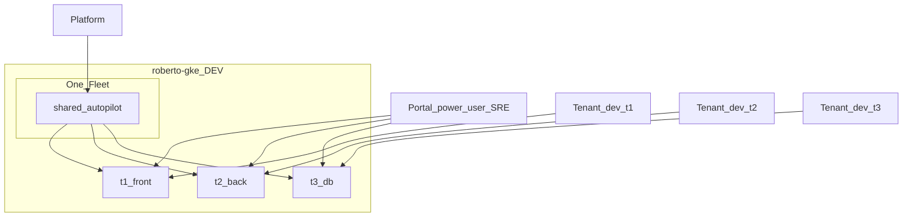

# IDP GKE PoC: locked scope and client demo design

Design baseline for this repo’s PoC vs Confluence platform docs (shared multi-workload GKE + namespace guardrails). Implementation checklist: [../DEVELOPMENT_PLAN.md](../DEVELOPMENT_PLAN.md).

Related: [IDP-GKE-CONSIDERATIONS.md](IDP-GKE-CONSIDERATIONS.md).

---

## 1. Locked PoC choice

| Layer | Decision |
|-------|----------|
| GCP project | **`roberto-gke` = DEV / nonprod only** |
| Policy folders (`prod` / `nonprod`) | **Not inside the project** (org-level only). Prod = later project/folder. |
| Cluster mode | **One shared Autopilot** cluster (idle-cheap PoC; Confluence production default remains **Standard**) |
| Fleet | **One fleet** (hard limit: one fleet per GCP project). Register the shared cluster for Hub visibility. |
| Tenancy | **Namespace isolation** on that shared cluster — **not** cluster-per-plane |
| Tenants | Namespaces: `t1-front`, `t2-back`, `t3-db` |
| Guardrails | Per namespace: **RBAC** + **ResourceQuota** (+ LimitRange) + **NetworkPolicy** |
| **Actors** | **Three planes**: platform · portal power-user · tenant (dev) |
| Demo apps | Deployed **as each team** (tenant plane); unauthorized actions must fail |



### Three planes (who does what)

| Plane | Who | Owns | PoC path |
|-------|-----|------|----------|
| **Platform** | Platform engineers | Cluster, fleet, network, APIs | Repo root / `make platform-up` |
| **Portal power-user** | Client SRE / tech lead | Namespace onboarding via Portal: quota, RBAC, netpol (catalog-constrained) | `tenant-guardrails/` / `make guardrails-up` |
| **Tenant (dev)** | Application developers | Workloads inside their namespace only | `tenant-apps/` / `make tenant-deploy` |

Power-users do **not** replace the platform: they instantiate **platform-approved catalog** shapes through the portal. Developers never create namespaces or edit NetworkPolicy.

### RBAC matrix (agency)

| Principal | `t1-front` | `t2-back` | `t3-db` |
|-----------|------------|-----------|---------|
| Team t1-FRONT (dev) | edit | deny | deny |
| Team t2-BACK (dev) | deny | edit | deny |
| Team t3-DB (dev) | deny | deny | edit |
| Portal power-user (via portal SA / elevated path) | provision guardrails (catalog) | same | same |
| Platform admin | cluster-admin / bootstrap | same | same |

`t3` does **not** get cross-namespace edit in v1.

---

## 2. Why not cluster-per-plane? Why still mention Fleet?

### Comparison

| | **A. Shared cluster + namespaces** (PoC choice) | **B. Cluster-per-plane** |
|--|--------------------------------------------------|--------------------------------------------------------------|
| Shape | 1 Autopilot, 3 namespaces | 2+ clusters; team ↔ whole cluster |
| Matches Confluence? | **Yes** — “shared regional clusters… namespaces per team/app with quotas, network policies” | Partial — stronger isolation, but not the documented **cost-optimised default** |
| Cost (Autopilot idle) | One control plane; pay mainly for running Pods | More clusters / more baseline overhead |
| Isolation strength | Soft multi-tenancy (RBAC + netpol + quota) | Harder blast-radius split (separate kube-apiserver/nodes) |
| Client story | “This is how the platform will host many apps” | “Premium / high-trust dedicated clusters” (catalog flavor later) |
| Ops complexity | One upgrade surface; policies per ns | N clusters to register, upgrade, observe |

**Reasoning for A:** Confluence Building Block View and cost goal (“share the expensive thing”) point to **shared multi-workload** clusters. Cluster-per-plane remains a valid **future catalog flavor**, not the PoC default.

### Fleet: use lightly, don’t make it the tenancy model

| Approach | Role in this PoC |
|----------|------------------|
| **Kubernetes namespaces** | **Primary tenancy** (RBAC, quota, NetworkPolicy) |
| **Fleet membership** | **Showcase**: cluster appears in Hub; path to Config Sync / multi-cluster later |
| **Fleet scopes / fleet namespaces** | **Defer** |

**Why mention Fleet at all?** Confluence and real GKE IDPs use Fleet for inventory and eventual GitOps/policy at scale.

**Why not two fleets (DEV/PROD)?** One project → one fleet. `roberto-gke` is DEV only.

Docs: [Fleet concepts](https://cloud.google.com/kubernetes-engine/fleet-management/docs/fleet-concepts).

---

## 3. Client demo script — three planes

Goal: live proof of **real GKE controls** with the right actors — platform paves runtime; power-user shapes namespaces; developers deploy inside.

### 3.0 Demo order (actors)

1. **Platform:** show Autopilot + fleet membership.  
2. **Power-user:** portal/CLI onboards `t1-front` / `t2-back` / `t3-db` with quotas + netpol + RBAC.  
3. **Developer:** portal/CLI deploys probes into `t1-front` only.  
4. Prove RBAC deny, quota fail, netpol ALLOW/DENY in logs.

### 3.1 Demo apps (minimal) — tenant plane

| Namespace | App | Role in chain |
|-----------|-----|----------------|
| `t1-front` | `front` | Calls `back` only |
| `t2-back` | `back` | Calls `db` only |
| `t3-db` | `db` | Serves data; **does not** call front/back |

```text
t1-front  --->  t2-back  --->  t3-db
   |               |              |
   +-- denied --> db         no egress to front/back
```

### 3.2 NetworkPolicy — power-user applied, developer proven

**Power-user / catalog intent:**

1. Default **deny ingress + egress** (except DNS) in each tenant namespace.  
2. Allow **in-namespace** traffic.  
3. Allow **egress t1-front → t2-back** (+ matching ingress).  
4. Allow **egress t2-back → t3-db** (+ matching ingress).  
5. **No** allow t1-front → t3-db; **no** allow t3-db → t1/t2.

| Probe | Expected |
|-------|----------|
| front → back | **Success** |
| back → db | **Success** |
| front → db (direct) | **Timeout / refused** |
| db → front or back | **Fail** |

Narration: *Developers cannot weaken NetworkPolicy; they only see ALLOW/DENY in app logs.*

### 3.3 ResourceQuota — power-user sets, developer hits the ceiling

- Power-user sets `t1-front` `pods: "2"` (+ CPU/memory).  
- Developer: replicas 2 → OK; replicas 3 → exceeded.  
- Raising quota = power-user (catalog) or platform exception — not the developer.

**PoC command:**

```bash
make tenant-deploy TENANT=t1-front REPLICAS=3   # expect: exceeded quota (pods=2)
```

### 3.4 RBAC — power-user binds, developer is confined

Power-user binds team principals to namespace `edit`. Developers succeed only in their ns; cross-ns apply → **Forbidden**.

**PoC commands** (your user is bound only to `t1-front` in `tenant-guardrails/terraform.tfvars`):

```bash
make tenant-can-i TENANT=t1-front AS=roberto.comsa@esolutions.ro   # expect: yes
make tenant-can-i TENANT=t2-back AS=roberto.comsa@esolutions.ro    # expect: no
```

Note: `terraform apply` as project admin bypasses RBAC; use `tenant-can-i` (`kubectl --as`) for the Forbidden story.

### 3.5 Suggested demo order (15–20 min)

See **[DEMO-RUNBOOK.md](DEMO-RUNBOOK.md)** for the live script. Summary:

1. Three-plane slide: platform / SRE power-user / developer.  
2. Platform: cluster + Fleet membership.  
3. Power-user: `make guardrails-up`.  
4. Developer: `make tenant-deploy-all` + `make demo-logs TENANT=t1-front`.  
5. RBAC: `make demo-rbac` → Forbidden on t2.  
6. Quota: `make demo-quota` → pods=2 exceeded, then restore.  
7. Map to Confluence / Backstage (two portal forms, one catalog).  
8. Optional WI / Config Sync teaser.

---

## 4. What else to showcase (GKE / fabric)

| Showcase | Why | How |
|----------|-----|-----|
| Autopilot shared cluster | Fast PoC | `gke-cluster-autopilot` (**platform**) |
| VPC-native subnet | Baseline | `network.tf` (**platform**) |
| Fleet registration | Hub inventory | `fleet_project` + `gke-hub` (**platform**) |
| Namespaces + RBAC + Quota + NetworkPolicy | Isolation catalog | `tenant-guardrails/` (**power-user**) |
| Probe Deployments | Tenant self-service | `tenant-apps/` (**dev**) |
| Workload Identity (light) | Confluence GCP access path | Stretch |
| Release channel `REGULAR` | Upgrade story | Module `release_channel` |

### Explicit “documented but not default in PoC”

| Topic | Message to client |
|-------|-------------------|
| **GKE Standard + node pools** | Confluence **default**; fabric modules ready when PoC leaves Autopilot |
| **Private clusters + Shared VPC** | LZ-mandated; out of scope unless network floor exists |
| **Argo CD / GitOps** | Real app/power-user reconciler; PoC uses Terraform CLI stand-ins |
| **Fleet scopes** | After single-cluster namespace tenancy |
| **Full Fabric FAST stages** | This PoC is **modules only** (path B) |

---

## 5. Mapping to Confluence responsibility boundary

| Concern | Platform | Portal power-user (SRE / tech lead) | Tenant (dev) |
|---------|----------|-------------------------------------|--------------|
| Runtime | Shared Autopilot, fleet | Uses it | Uses it |
| Namespace | Catalog + policy floor | **Creates/shapes via portal** | Cannot create |
| Quota / netpol / RBAC bindings | Catalog definitions | **Applies within catalog** | Cannot edit |
| App delivery | — | — | **Deployments/Services in their ns** |
| Cost fairness | Catalog tiers | Chooses tier at onboarding | Replicas inside quota |
| Isolation | Allowed netpol patterns | Picks chain pattern | Sees ALLOW/DENY only |

---

## 6. Implementation milestones

1. Shared Autopilot + network + fleet (**platform**) — done.  
2. Verify Hub membership.  
3. Guardrails stack for three teams (**power-user**) — code done; apply next.  
4. Tenant probe apps + portal CLI (**dev**).  
5. Negative tests + three-plane demo runbook.  
6. Optional: WI / Config Sync.

---

## 7. Open questions

| Question | Proposal |
|----------|----------|
| t3 read-only in front/back? | **No** for v1 |
| Exact quota (e.g. pods=2 for front)? | **pods: "2"** for clearest scale demo |
| NetworkPolicy DNS egress allow? | **Yes** (kube-dns) |
| Principals = users or Groups? | Groups if available; else users for PoC |
| Who raises quota above catalog? | Platform exception; power-user only within tiers |
| Include WI in first client demo? | **Yes if time** |

---

## 8. Verdict

Locked PoC: **`roberto-gke` DEV · one fleet · one shared Autopilot · three namespaces · three actors**.

- **Platform** owns the runtime.  
- **Portal power-user** owns namespace onboarding (quota / RBAC / netpol) via portal.  
- **Tenant developers** own workloads inside their namespace.  
- Demo: RBAC + NetworkPolicy chain + ResourceQuota, told through those three roles.
