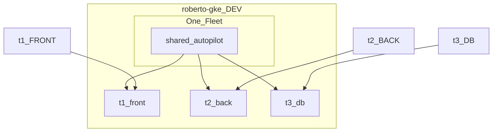

# IDP GKE PoC: locked scope and client demo design

Design-only. Aligns this repo’s PoC with Confluence platform docs (shared multi-workload GKE + namespace guardrails). No Terraform implementation in this file.

Related: [IDP-GKE-CONSIDERATIONS.md](IDP-GKE-CONSIDERATIONS.md).

---

## 1. Locked PoC choice

| Layer | Decision |
|-------|----------|
| GCP project | **`roberto-gke` = DEV / nonprod only** |
| Policy folders (`prod` / `nonprod`) | **Not inside the project** (org-level only). Prod = later project/folder. |
| Cluster mode | **One shared Autopilot** cluster (idle-cheap PoC; Confluence production default remains **Standard**) |
| Fleet | **One fleet** (hard limit: one fleet per GCP project). Register the shared cluster for Hub visibility. |
| Tenancy | **Namespace isolation** on that shared cluster — **not** cluster-per-plane |
| Tenants | Namespaces: `t1-front`, `t2-back`, `t3-db` |
| Platform controls | Per namespace: **RBAC** + **ResourceQuota** (+ LimitRange) + **NetworkPolicy** |
| Demo apps | Terraform (or kubectl) **as each team**; unauthorized actions must fail |



### RBAC matrix (agency)

| Principal | `t1-front` | `t2-back` | `t3-db` |
|-----------|------------|-----------|---------|
| Team t1-FRONT | edit | deny | deny |
| Team t2-BACK | deny | edit | deny |
| Team t3-DB | deny (PoC default) | deny (PoC default) | edit |
| Platform admin | cluster-admin / bootstrap | same | same |

`t3` does **not** get cross-namespace edit in v1. Optional later: read-only in front/back for debugging.

---

## 2. Why not cluster-per-plane? Why still mention Fleet?

### Comparison

| | **A. Shared cluster + namespaces** (PoC choice) | **B. Cluster-per-plane** |
|--|--------------------------------------------------|--------------------------------------------------------------|
| Shape | 1 Autopilot, 3 namespaces | 2+ clusters; team ↔ whole cluster |
| Matches Confluence? | **Yes** — “shared regional clusters… namespaces per team/app with quotas, network policies” | Partial — stronger isolation, but not the documented **cost-optimised default** |
| Cost (Autopilot idle) | One control plane; pay mainly for running Pods | More clusters / more baseline overhead |
| Isolation strength | Soft multi-tenancy (RBAC + netpol + quota) | Harder blast-radius split (separate kube-apiserver/nodes) |
| Client story | “This is how the platform will host many apps” | “Premium / high-trust dedicated clusters” (catalog flavor later) |
| Ops complexity | One upgrade surface; policies per ns | N clusters to register, upgrade, observe |

**Reasoning for A:** Confluence Building Block View and cost goal (“share the expensive thing”) point to **shared multi-workload** clusters. Cluster-per-plane remains a valid **future catalog flavor** (dedicated cluster for a domain), not the PoC default.

### Fleet: use lightly, don’t make it the tenancy model

| Approach | Role in this PoC |
|----------|------------------|
| **Kubernetes namespaces** | **Primary tenancy** (RBAC, quota, NetworkPolicy) |
| **Fleet membership** | **Showcase**: cluster appears in Hub; path to Config Sync / multi-cluster later |
| **Fleet scopes / fleet namespaces** | **Defer** — multi-cluster team UX; not needed to prove shared-cluster isolation |

**Why mention Fleet at all?** Confluence and real GKE IDPs use Fleet for inventory and eventual GitOps/policy at scale. Showing `fleet_project` / `gke-hub` registration proves fabric capability without pretending Fleet scopes replace namespaces.

**Why not two fleets (DEV/PROD)?** One project → one fleet. `roberto-gke` is DEV only; a second fleet needs a second project (and ideally a prod folder).

Docs: [Fleet concepts](https://cloud.google.com/kubernetes-engine/fleet-management/docs/fleet-concepts).

---

## 3. Client demo script — showcase via tenants

Goal: live proof of **real GKE controls** that match Confluence guardrails (platform owns quotas/netpol/RBAC; teams own workloads inside).

### 3.1 Demo apps (minimal)

Three tiny HTTP services (e.g. `nginx` or a small `hello` image), one per namespace:

| Namespace | App | Role in chain |
|-----------|-----|----------------|
| `t1-front` | `front` | Calls `back` only |
| `t2-back` | `back` | Calls `db` only |
| `t3-db` | `db` | Serves data; **does not** call front/back |

Traffic shape (fits front → back → db):

```text
t1-front  --->  t2-back  --->  t3-db
   |               |              |
   +-- denied --> db         no egress to front/back
   +-- denied --> (anyone else)
```

This is the correct reading of “t1 talks to t2 only, t2 to t3 only, t3 talks to no one”: a **request chain**, not mesh of peers. DB is a **callee**, not a caller.

### 3.2 NetworkPolicy — what to show

**Platform-applied policies (intent):**

1. Default **deny ingress + egress** (except DNS) in each tenant namespace.  
2. Allow **in-namespace** traffic (Pods of the same app).  
3. Allow **egress t1-front → t2-back** (specific port, e.g. 8080) and matching **ingress on t2-back from t1-front**.  
4. Allow **egress t2-back → t3-db** and matching **ingress on t3-db from t2-back**.  
5. **No** allow t1-front → t3-db; **no** allow t3-db → t1/t2.

**Live checks (from a debug Pod or app logs):**

| Probe | Expected |
|-------|----------|
| front → back | **Success** |
| back → db | **Success** |
| front → db (direct) | **Timeout / refused** (NetworkPolicy) |
| db → front or back | **Fail** |
| front → `kube-system` or random ns | **Fail** |

Narration: *RBAC is about the Kubernetes API; NetworkPolicy is about packet path between workloads on a shared cluster — both are required for Confluence-style isolation.*

Docs: [Network policies](https://kubernetes.io/docs/concepts/services-networking/network-policies/), [GKE network policy](https://cloud.google.com/kubernetes-engine/docs/how-to/network-policy).

### 3.3 ResourceQuota — what to show

**Platform-applied example (illustrative):**

- Namespace `t1-front`: `pods: "2"`, plus CPU/memory request caps.  
- LimitRange: default requests so Autopilot always sees CPU/memory.

**Live check:**

1. As t1, Deployment `front` with `replicas: 2` → **OK**.  
2. Scale to `replicas: 3` (or apply a change that creates a 3rd Pod) → **Forbidden / exceeded quota**.  
3. Show `kubectl describe resourcequota -n t1-front` (used vs hard).  
4. Optional: raise quota as platform, retry scale → **OK** (platform owns guardrails; team cannot self-raise).

Narration: *On Autopilot, cost tracks Pod requests; quotas are how the platform enforces fair share on a shared cluster (Confluence: platform provides quotas; team owns requests inside them).*

Docs: [Resource quotas](https://kubernetes.io/docs/concepts/policy/resource-quotas/).

### 3.4 RBAC — what to show

**Setup:** three principals (Google users/groups or GKE service accounts) bound only to their namespace Role (`edit` or a custom Role).

**Live checks:**

| Actor | Action | Expected |
|-------|--------|----------|
| t1 | `apply` Deployment in `t1-front` | **Success** |
| t1 | `apply` in `t2-back` or `t3-db` | **Forbidden** |
| t2 | scale `back` in `t2-back` | **Success** |
| t2 | get secrets in `t1-front` | **Forbidden** |
| t3 | deploy in `t3-db` | **Success** |
| t3 | delete Deployment in `t1-front` | **Forbidden** |

Implement with Terraform using **impersonation** or separate credentials per team so the failure is authentic (not “platform admin accidentally succeeds”).

Narration: *Self-service inside the namespace; the platform owns RoleBindings — teams cannot grant themselves access to another tenant.*

### 3.5 Suggested demo order (15–20 min)

1. Architecture slide: one project DEV, one Autopilot, one fleet, three namespaces.  
2. Show cluster in GCP Console + Fleet membership.  
3. RBAC deny/allow.  
4. NetworkPolicy chain (front→back→db) + blocked shortcuts.  
5. Quota scale 2→3 fail.  
6. Map each control to Confluence “platform provides / team owns”.  
7. (Optional) Workload Identity or Config Sync teaser — see below.

---

## 4. What else to showcase (GKE / fabric) for the client?

Prioritized for **alignment with Confluence** and **fabric modules you already vendor**.

### In scope for this PoC (recommended)

| Showcase | Why (Confluence / client) | How (fabric / GKE) |
|----------|---------------------------|---------------------|
| Autopilot shared cluster | Fast PoC; contrast with Standard default in docs | `gke-cluster-autopilot` |
| VPC-native subnet + secondary ranges | Required baseline | Existing `network.tf` pattern |
| Fleet **registration** | Hub inventory; path to multi-cluster | `fleet_project` + `gke-hub` |
| Namespaces + RBAC + Quota + NetworkPolicy | Exact Confluence workload isolation | Kubernetes provider / manifests (platform-owned) |
| Workload Identity (light) | “Only path to GCP APIs” in Confluence | Annotate KSA→GSA; Pod reads a Secret Manager secret or GCS |
| Cloud Logging / Monitoring basics | Observability spine | Autopilot defaults + one log query filtered by `namespace` |
| Release channel `REGULAR` | Upgrade story | Module `release_channel` |

### Explicit “documented but not default in PoC” (say out loud)

| Topic | Message to client |
|-------|-------------------|
| **GKE Standard + node pools** | Confluence **default** cost/ops model; fabric `gke-cluster-standard` + `gke-nodepool` ready when PoC leaves Autopilot |
| **Private clusters + Shared VPC** | Mandated by LZ (`vmExternalIpAccess=deny`); out of scope in `roberto-gke` demo unless network floor exists |
| **Argo CD / GitOps for apps** | Confluence app plane; PoC uses Terraform for speed — same objects, different reconciler |
| **Binary Authorization / signed images** | Prod gate; mention, don’t block DEV PoC |
| **Fleet scopes / fleet namespaces** | Next step after single-cluster namespace tenancy |
| **Full Fabric FAST stages** | Org landing zone; this PoC is **modules only** (path B) |

### Nice-to-have stretch (only if time)

- Config Sync syncing `platform-gitops`-style baselines (quota/netpol from Git).  
- Policy Controller / Pod Security.  
- Second cluster in same fleet to preview multi-cluster Hub (still one env).  
- Autopilot compute class / explicit Pod requests vs defaults.

---

## 5. Mapping to Confluence responsibility boundary

| Concern | Platform (PoC demo) | Tenant teams (PoC demo) |
|---------|---------------------|-------------------------|
| Runtime | Shared Autopilot cluster, fleet membership | Workloads in their namespace |
| Namespace | Create ns + RBAC + Quota + NetworkPolicy | Cannot create ns or bind cluster-admin |
| Delivery | Terraform (stand-in for Argo) applying apps *as team* | “Their” app manifests only where allowed |
| Cost | Quotas / show used vs hard | Choose replica counts inside quota |
| Isolation | NetworkPolicy chain | Cannot bypass with direct front→db |

---

## 6. Implementation milestones (after you approve)

1. Shared Autopilot + network in `roberto-gke`.  
2. Fleet register (`fleet_project` / `gke-hub`).  
3. Namespaces + RBAC bindings for three teams.  
4. ResourceQuota + LimitRange; scale-fail demo.  
5. NetworkPolicy chain; connectivity probes.  
6. Demo apps + scripted allow/deny checks.  
7. Optional: Workload Identity → Secret Manager read.  
8. Demo narrative deck: Autopilot vs Standard, folders vs single DEV project.

---

## 7. Open questions

| Question | Proposal |
|----------|----------|
| t3 read-only in front/back? | **No** for v1 |
| Exact quota (e.g. pods=2 for front)? | **pods: "2"** for clearest scale demo |
| NetworkPolicy DNS egress allow? | **Yes** (kube-dns) |
| Principals = personal users or Google Groups? | Groups if available; else users for PoC |
| Include Workload Identity in first client demo? | **Yes if time** — high Confluence alignment |

---

## 8. Verdict

Locked PoC: **`roberto-gke` DEV · one fleet · one shared Autopilot · three namespaces · RBAC + quotas + NetworkPolicy**.

- Prefer **shared + namespaces** over **cluster-per-plane** to match Confluence cost/tenancy defaults; keep dedicated clusters as a future flavor.  
- **Fleet** = registration/showcase, not the tenancy mechanism.  
- Demo story: **RBAC** (API agency), **NetworkPolicy** (front→back→db chain), **ResourceQuota** (scale 2→3 fails), plus fabric Autopilot + optional WI/logging for a credible client narrative.
